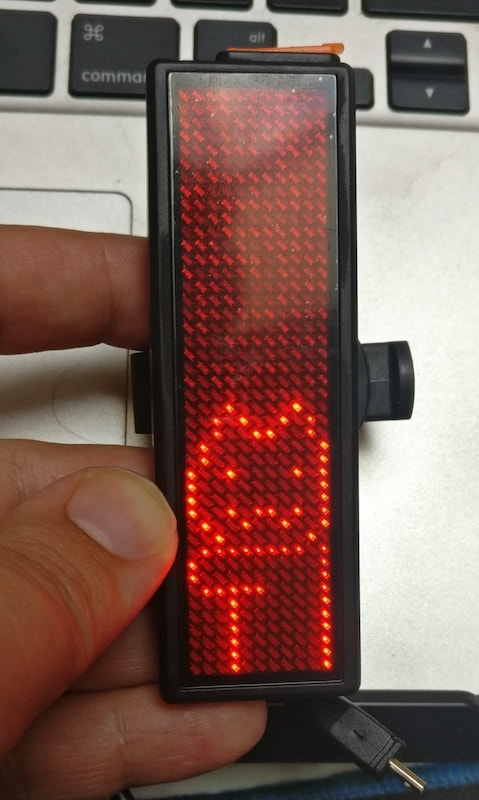

ledbadger
=========

This repo contains tools for interacting with [XANES X1 programmable LED bicycle taillights](xx1)

The management tools for the badges that ship with the taillights (LEDBadge and BMPBadge)
are Windows-only, and to be quite honest, rather horrible.

The code in this repo was reverse-engineered from BMPBadge, which is, handily enough, .NET and
thus readily decompilable with DotPeek or other tools, and by looking at the USB HID protocol messages
being sent to the device.

Usage
-----

Things may be a little flaky, but if you want longcat on your display,

* `pip install -r requirements.txt`
* `python send_custom.py`

> 
>
> Longcat is somewhat long, and not very well drawn.

---

[xx1]: https://www.banggood.com/XANES-X1-DIY-Bicycle-Taillight-Programmable-LED-Electronic-Advertising-Display-Bicycle-TailLight-USB-p-1220458.html